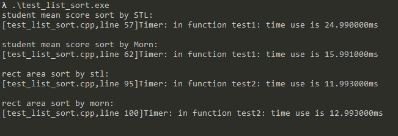

## Morn：容器（2）

上次的MList没有讲完，这次接着说。

### MList操作

这里主要是一些需要借助回调函数完成的功能：


#### MList元素运算

```c
void mListElementOperate(MList,void (*func)(void *,void *),void *para);
```

这个是遍历容器中的每个元素，对每个元素执行func函数操作。例如，对MList中的一众数据取阈值。

```c
int main()
{
    MList *list = mListCreate(DFLT,NULL);
    printf("before\n");
    for(int i=0;i<8;i++)
    {
        int a=mRand(0,10);
        printf("%d,",a);
        mListWrite(list,DFLT,&a,sizeof(int));
    }
    void Threshold(void *data,void *para)
    {
        int *p = data;
        *p=(*p>5)?10:0;
    }
    mListElementOperate(list,Threshold,NULL);
    printf("\nafter\n");
    for(int i=0;i<list->num;i++)
        printf("%d,",*((int *)list->data[i]));
    mListRelease(list);
    return 0;
}
```

运行结果为：

```
before
1,7,4,0,9,4,8,8,
after
0,10,0,0,10,0,10,10,
```


#### MList筛选元素

```c
void mListElementScreen(MList *list,int (*func)(void *,void *),void *para);
```

例如，从一众整数中筛选出偶数：

```c
int main()
{
    MList *list = mListCreate(DFLT,NULL);
    printf("before\n");
    for(int i=0;i<8;i++)
    {
        int a=mRand(0,10);
        printf("%d,",a);
        mListWrite(list,DFLT,&a,sizeof(int));
    }
    int EvenScreen(void *data,void *para)
    {
        int *p = pdata;return ((*p)%2==0);
    }
    mListElementScreen(list,EvenScreen,NULL);
    printf("\nafter\n");
    for(int i=0;i<list->num;i++)
        printf("%d,",*((int *)list->data[i]));
    mListRelease(list);
    return 0;
}
```

运行结果为：

```
before
1,7,4,0,9,4,8,8,
after
4,0,4,8,8,
```


#### MList比选元素

```c
void mListElementSelect(MList *list,void (*func)(void *,void *,int *,int *,void *),void *para);
```

比选和筛选的区别，筛选是单个元素选择去还是留，比选是两两元素捉对比较后再决定哪个去哪个留（或者两个都去，再或者两个都留）

例如：从一众整数中删除重复的数：

```c
int main()
{
    MList *list = mListCreate(DFLT,NULL);
    printf("before\n");
    for(int i=0;i<8;i++)
    {
        int a=mRand(0,10);
        printf("%d,",a);
        mListWrite(list,DFLT,&a,sizeof(int));
    }
    void DuplicateDelete(void *data1,void *data2,int *flag1,int *flag2,void *para)
    {
        int *p1 = data1;
        int *p2 = data2;
        *flag1 = 1;
        *flag2 = (*p2!=*p1);
    }
    mListElementSelect(list,DuplicateDelete,NULL);
    printf("\nafter\n");
    for(int i=0;i<list->num;i++)
        printf("%d,",*((int *)list->data[i]));
    mListRelease(list);
    return 0;
}
```

运行结果为：

```
before
1,7,4,0,9,4,8,8,
after
1,7,4,0,9,8,
```


#### MList元素乱序

```c
void mListReorder(MList *list);
```

这个比较简单，就是把原有的MList的元素排列，随机的打乱顺序。


#### MList元素排序

```c
void mListSort(MList *list,int func(void *,void *,void *),void *para);
```

因为MList里面装的东西不一定是"数"，所以排序的时候需要使用者首先定义（即func函数）什么是“大于”（func函数输出大于0），什么是“小于”（func函数输出小于0），什么是“等于”（func函数输出等于0）。例如，对上例中的数进行排序。

```c
int main()
{
    MList *list = mListCreate(DFLT,NULL);
    printf("before\n");
    for(int i=0;i<8;i++)
    {
        int a=mRand(0,10);
        printf("%d,",a);
        mListWrite(list,DFLT,&a,sizeof(int));
    }
    int Compare(void *data1,void *data2,void *para)
    {
        
        int *p1 = data1;
        int *p2 = data2;
        return (p[0]-p[0]);
    }
    mListSort(list,Compare,NULL);
    printf("\nafter sort\n");
    for(int i=0;i<list->num;i++)
        printf("%d,",*((int *)list->data[i]));
    mListReorder(list);
    printf("\nafter reorder\n");
    for(int i=0;i<list->num;i++)
        printf("%d,",*((int *)list->data[i]));
    mListRelease(list);
    return 0;
}
```

运行结果为：

```
before
1,7,4,0,9,4,8,8,
after sort
0,1,4,4,7,8,8,9,
after reorder
1,8,4,9,4,0,7,8,
```

此例同时演示了sort和reorder，可以看到，经过排序后，数据变成由小及大递增排列，reorder后，数据变成无序排列。


#### MList元素聚类

```c
int mListCluster(MList *list,int *group,int (*func)(void *,void *,void *),void *para);
```

这个函数的输出为group，它保存了list中每个元素的类别，函数的返回值为元素的种类数量。

例如，一众整数，我们可以把彼此靠近的数聚为一类。

```c
int main()
{
    MList *list = mListCreate(DFLT,NULL);
    printf("before\n");
    for(int i=0;i<8;i++)
    {
        int a=mRand(0,10);
        printf("%d,",a);
        mListWrite(list,DFLT,&a,sizeof(int));
    }
    int Neighbor(void *data1,void *data2,void *para)
    {
        int *p1 = data1;
        int *p2 = data2;
        return (ABS((*p1)-(*p2))<=1);
    }
    int group[list->num];
    int group_num = mListCluster(list,group,Neighbor,NULL);
    printf("\nafter\n");
    printf("group num is %d\n",group_num);
    for(int i=0;i<list->num;i++)
        printf("%d(group%d),",*((int *)list->data[i]),group[i]);
    mListRelease(list);
    return 0;
}
```

运行结果为：

```
before
1,7,4,0,9,4,8,8,
after
group num is 3
1(group0),7(group1),4(group2),0(group0),9(group1),4(group2),8(group1),8(group1),
```

可见经过聚类后，原有8个数被分成了三类：group0中有0和1两个数，group1中有7/8/8/9四个数，group2中有两个4。


以上例子都在 [../test/test_list.c](../test/test_list.c)文件中。


### 性能

这里主要比较排序的性能（除了排序，别的功能不知道应该跟谁比）。

写了两段程序，在[../doc/test_list_sort.cpp](../doc/test_list_sort.cpp)文件里。这两段程序都很简单，分别对100000份样本进行排序，其中第一段是对学生的平均成绩进行排序，第二段是对矩形的面积进行排序。

这里比较了两种方式：C++的STL容器，Morn的Mlist。

运行结果如下：

可以看到，在第一段程序（即学生成绩排序）中，Morn要快于STL，在第二段程序（即矩形面积排序）中，STL要快于Morn。

基本上可以总结出这样的规律：①当排序的比较函数简单的时候，Morn通常快于STL，反之STL快于Morn，②当排序的元素内存占用小的时候，STL通常快于Morn，反之Morn快于STL。