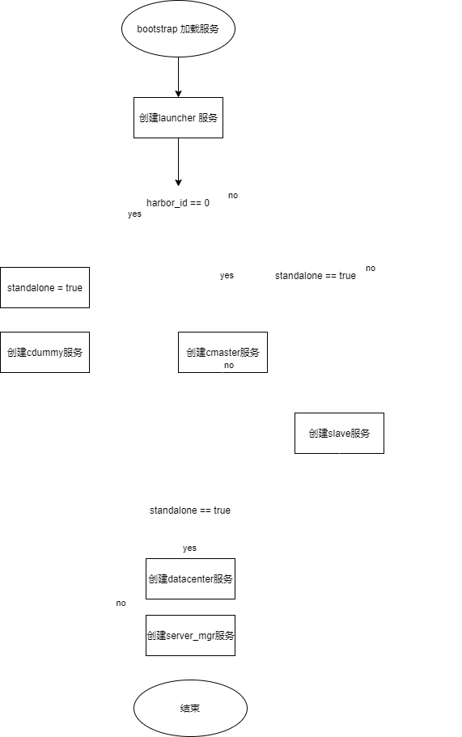

bootstrap用于创建节点的初始服务。
有图可见
单节点初始服务：launcher  datacenter    server_mgr                           cdummy

多节点初始服务：
	master节点：   launcher   datacenter    server_mgr    master  slave 
	cslave节点：    launcher                        server_mgr                 slave

